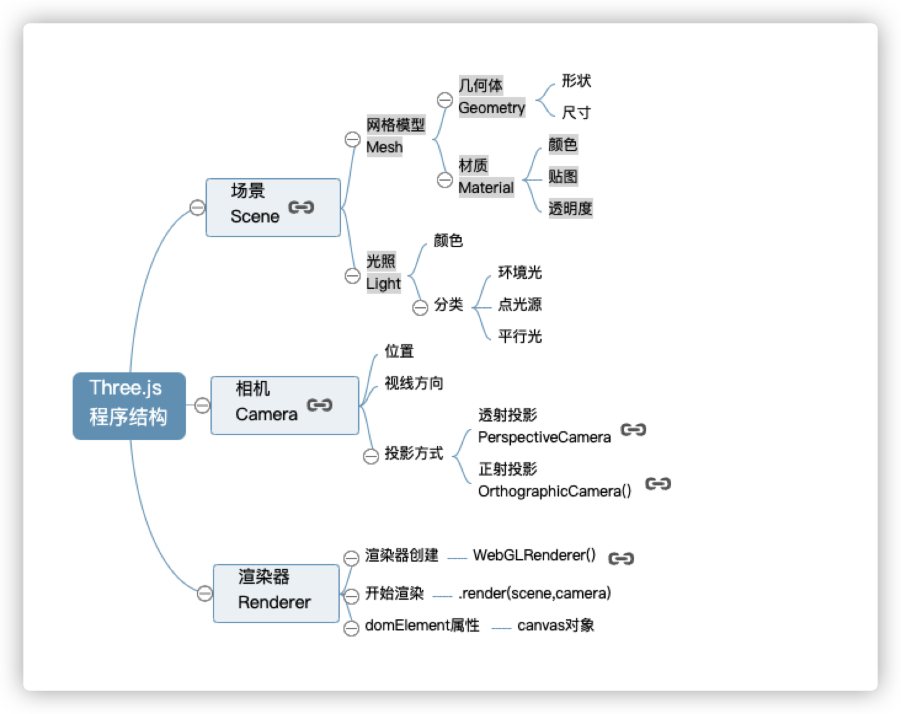
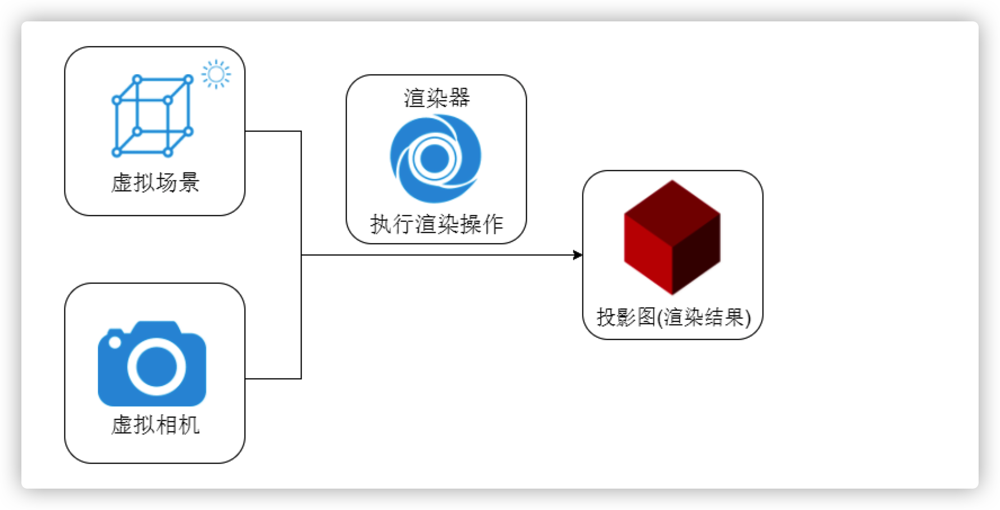

# 基本概念

threeJs是基于原生WebGL封装运行对三维引擎。

## ThreeJs程序结构

理解threeJs的运行原理,从我们日常拍照的原理一样。我们拍照需要地点,相机，打光 ,然后咔按下。

;

### 场景(Scene)

类似一个三维立体空间,在三维空间我们创建所需要的立方体。

```js
// 创建场景对象...
const scene = new ThreeJs.Scene();

```

#### 网格模型(mesh)

一个立体体和一个材质对象组合成一个网络模型。

```js
const geometry = new ThreeJs.BoxGeomertry(20, 150, 150);
const material = new ThreeJs.MeshLambertMaterial({
    color: "0xfff"
})
const mesh = new ThreeJs.Mesh(geometry, material);
```

#### 创建光源

```js
const point = new ThreeJs.PointLight('0xfff');
point.position.set(900, 200, 300);

// 环境光
const ambient = new ThreeJs.AmbientLight('0x444');
```

### 相机(Camera)

在那个角度或者在何处查看场景。

```js
const camera = new ThreeJs.OrthographicCamera();
camera.position.set(200, 20, 20);
```

### 渲染器(renderer)

从实际生活中拍照角度或是使用三维渲染软件角度理解本节课的案例代码，
立方体网格模型和光照组成了一个虚拟的三维场景,相机对象就像你生活中使用的相机一样可以拍照，只不过一个是拍摄真实的景物，一个是拍摄虚拟的景物，拍摄一个物体的时候相机的位置和角度需要设置，虚拟的相机还需要设置投影方式，当你创建好一个三维场景，
相机也设置好，就差一个动作“咔”，通过渲染器就可以执行拍照动作。
;
